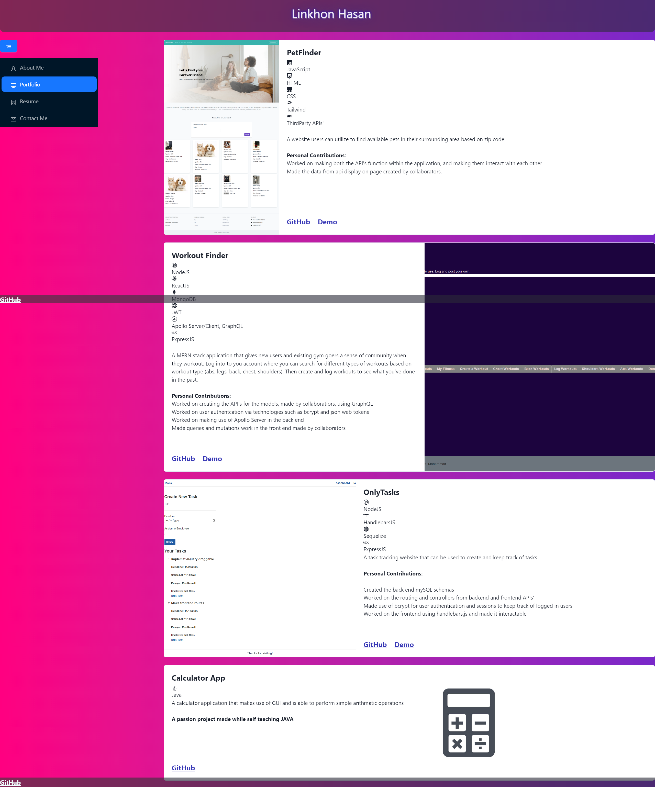
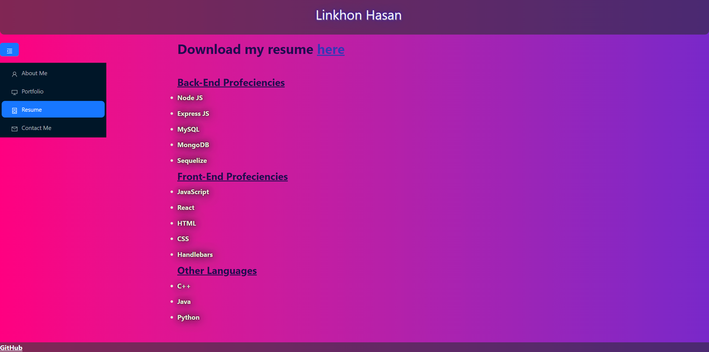
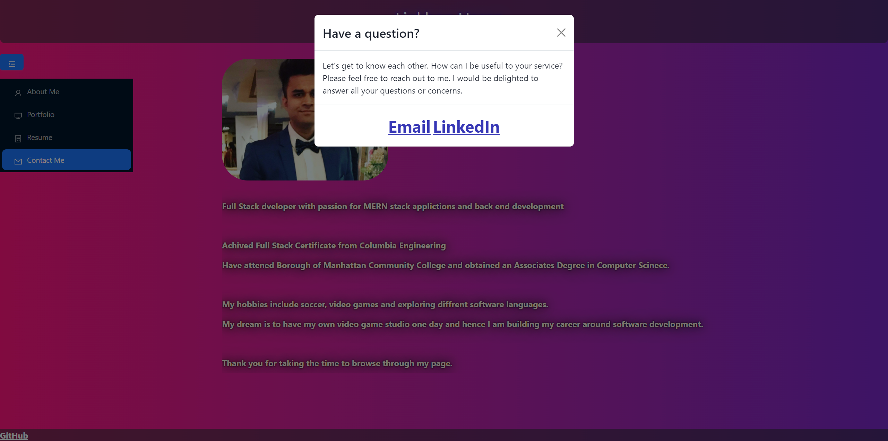

# Title
Personal_Portfolio

# Table of Contents
[Description](#description)

[Usage](#usage)

[Screenshots](#screenshots)

[Deployment](#deploymet)

[Contributors](#contributors)

[Questions](#questions)

## Description
A webpage I created using react that holds information about me as a software developer

## Usage
A webpage that showcases a portion of my portfolio and can be used to get in contact with me

## Screenshots

## Deployment
https://mkhlink.github.io/enhanced-portfolio/

## Contribution
Mohammad Komol Hasan

## Questions
GitHub: MKHLink

Email: likhonhasankomol@gmail.com
    